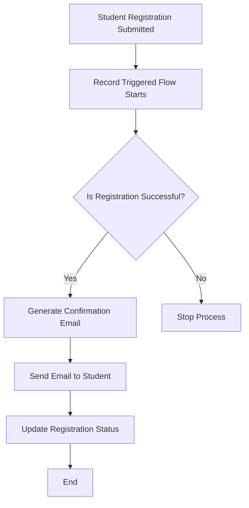

# Flow Builder

## What is Flow Builder?

Flow Builder is a Salesforce automation tool used to automate business processes without writing code. It helps organizations create workflows, collect data, update records, send notifications, and guide users through processes using a visual interface.

Flow Builder improves:
- Productivity
- Accuracy
- Speed
- Business efficiency

It is widely used in enterprise systems to automate repetitive tasks.

---

# Types of Flows

## Screen Flow

Screen Flow is an interactive flow that displays screens to users and collects input.

### Uses
- Student registration forms
- Feedback forms
- Course enrollment process
- Admission applications

### Features
- User interaction
- Input fields
- Buttons and navigation
- Dynamic screens

---

## Record-Triggered Flow

Record-Triggered Flow runs automatically when a Salesforce record is created, updated, or deleted.

### Uses
- Send automatic emails
- Update records automatically
- Generate notifications
- Validate business conditions

### Features
- Fully automated
- No user interaction required
- Works in the background

---

# Automation Ideas for College Management System

## 1. Auto Email After Student Registration

When a student successfully registers, the system automatically sends a confirmation email with admission details.

### Why automation helps
- Saves staff time
- Instant communication
- Reduces manual work

---

## 2. Auto Update Remaining Seats

When a student enrolls in a course, available seats are automatically reduced.

### Why automation helps
- Prevents overbooking
- Maintains accurate seat count
- Reduces human errors

---

## 3. Notify Faculty When Course Is Full

When course capacity reaches maximum limit, faculty members receive automatic notifications.

### Why automation helps
- Quick awareness
- Better course planning
- Easier student management

---

## 4. Generate Student ID Automatically

When admission is approved, the system automatically generates a unique student ID.

### Why automation helps
- Faster admission process
- Avoids duplicate IDs
- Improves consistency

---

## 5. Send Reminder Before Fee Deadline

Students automatically receive reminders before fee payment deadlines.

### Why automation helps
- Improves payment completion
- Reduces late payments
- Saves administrative effort

---

# Flow Design Thinking

## Selected Process
Auto Email After Student Registration

## Flow Diagram

---

# Manual vs Automated Process

## Process
Fee Payment Reminder

### Manual Process

In the manual process:
- Staff members track payment deadlines manually
- They prepare reminder messages
- Emails or phone calls are made individually
- Records are updated manually

### Problems in Manual Process

- Time consuming
- Human errors
- Missed reminders
- Delayed communication
- Increased workload

---

### Automated Process Using Salesforce

Using Salesforce automation:
- System checks fee deadlines automatically
- Reminder emails are scheduled automatically
- Notifications are sent instantly
- Payment records update automatically

### Benefits

- Faster process
- Accurate reminders
- Reduced workload
- Better student communication
- Improved efficiency

---

# Reflection

## Why should companies automate repetitive business processes?

Companies should automate repetitive business processes because automation improves speed, accuracy, and efficiency. Manual processes consume time and increase the chance of human errors. Automation reduces repetitive work, helps employees focus on important tasks, and improves customer experience.

In enterprise systems, automation also:
- Saves operational cost
- Improves productivity
- Provides faster responses
- Maintains data consistency
- Supports scalability

Automation is important because modern organizations handle large amounts of data and tasks daily. Without automation, managing business operations becomes slow and inefficient.
